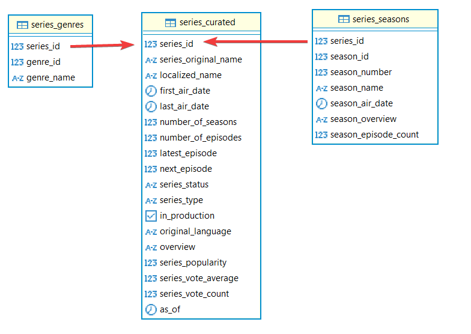
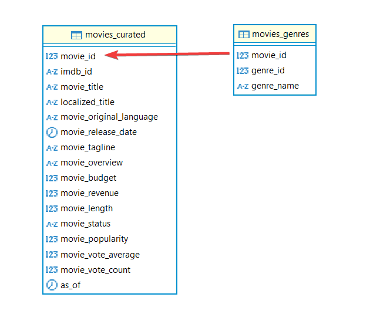
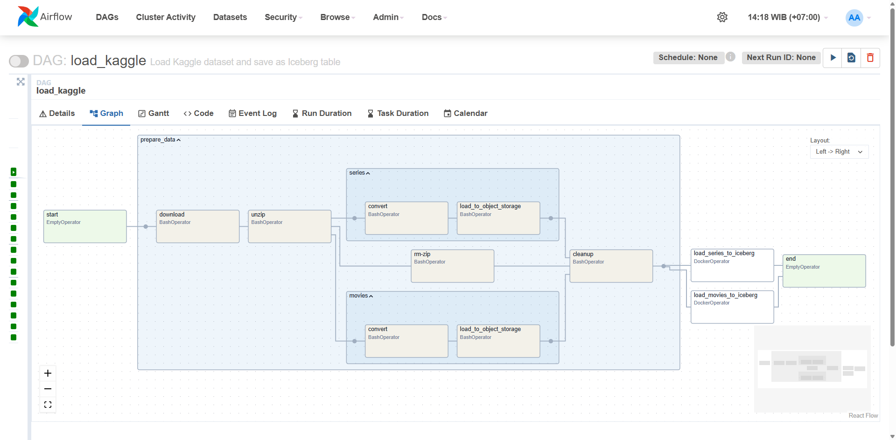
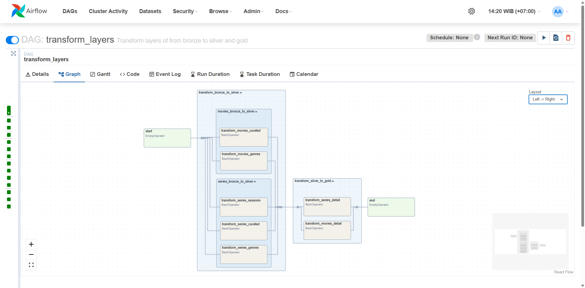
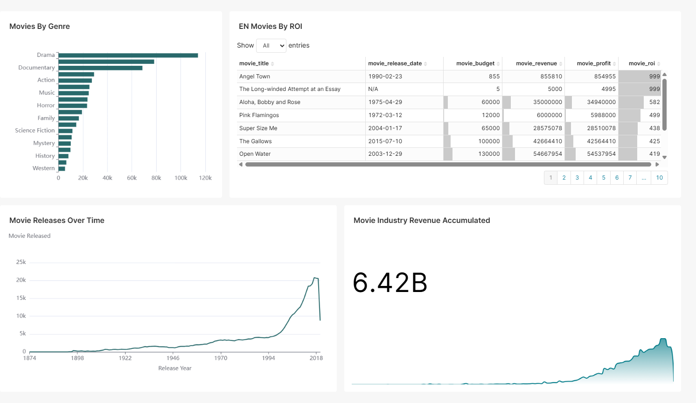
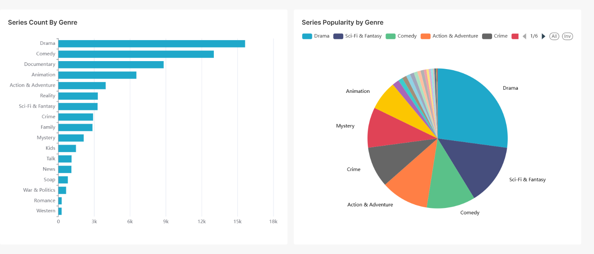

# TMDB Movies and Series End to End Data Engineering

This repo is created to demonstrate an end-to-end data engineering pipeline for TMDB movies and series data.

## Introduction

This project focuses on building a data engineering pipeline to extract, transform, and load (ETL) data related to movies and series from TMDB. The pipeline is designed to handle large-scale data efficiently and provide insights through processed datasets.

## Architecture

This project follows a Lakehouse architecture setup, which combines the best features of data lakes and data warehouses. The architecture is designed to handle large-scale data processing and analytics efficiently.


### Tech Stack

- **Docker**: Container to provide isolation.
- **Airflow**: For orchestrating and scheduling data pipeline workflows.
- **MinIO**: As the object storage layer for the data lake.
- **Iceberg & Iceberg REST Catalog**: To manage large-scale tabular data with features such as ACID transactions, Schema Evolution, and Time Travel.
- **Trino**: For distributed SQL query engine to query data on the data lake.
- **Superset**: For Dashboard

## Data Lakehouse Design Schema

The data lakehouse is designed into 4 different layers, starting from LANDING, BRONZE, SILVER, and GOLD.

### LANDING ZONE

This zone has no structured design, this zone is for the purpose of dumping data into the datalake, therefore data in this zone are not registered to the Data Catalog (Iceberg REST Catalog).

### BRONZE ZONE

This zone is where the raw data resides. Data is loaded and registered into the Catalog with its schema as is. In this case, the data still contains nested data that may need to be processed further. The following is the schema for the table movies and series in the bronze layer:

- Table `bronze.series`

  ```json
  {
    "backdrop_path": "string",
    "created_by": [
      {
        "id": "int64",
        "credit_id": "string",
        "name": "string",
        "gender": "int64",
        "profile_path": "string"
      }
    ],
    "episode_run_time": [
      "int64"
    ],
    "first_air_date": "string",
    "genres": [
      {
        "id": "int64",
        "name": "string"
      }
    ],
    "homepage": "string",
    "id": "int64",
    "in_production": "bool",
    "languages": [
      "string"
    ],
    "last_air_date": "string",
    "last_episode_to_air": {
      "air_date": "string",
      "episode_number": "int64",
      "id": "int64",
      "name": "string",
      "overview": "string",
      "production_code": "string",
      "season_number": "int64",
      "show_id": "int64",
      "still_path": "string",
      "vote_average": "double",
      "vote_count": "int64"
    },
    "name": "string",
    "next_episode_to_air": {
      "air_date": "string",
      "episode_number": "int64",
      "id": "int64",
      "name": "string",
      "overview": "string",
      "production_code": "string",
      "season_number": "int64",
      "show_id": "int64",
      "still_path": "string",
      "vote_average": "int64",
      "vote_count": "int64"
    },
    "networks": [
      {
        "name": "string",
        "id": "int64",
        "logo_path": "string",
        "origin_country": "string"
      }
    ],
    "number_of_episodes": "int64",
    "number_of_seasons": "int64",
    "origin_country": [
      "string"
    ],
    "original_language": "string",
    "original_name": "string",
    "overview": "string",
    "popularity": "double",
    "poster_path": "string",
    "production_companies": [
      {
        "id": "int64",
        "logo_path": "string",
        "name": "string",
        "origin_country": "string"
      }
    ],
    "seasons": [
      {
        "air_date": "string",
        "episode_count": "int64",
        "id": "int64",
        "name": "string",
        "overview": "string",
        "poster_path": "string",
        "season_number": "int64"
      }
    ],
    "status": "string",
    "type": "string",
    "vote_average": "double",
    "vote_count": "int64",
    "_ingest_ts": "int64"
  }
  ```

- Table `bronze.movies`

  ```json
  {
    "adult": "bool",
    "backdrop_path": "large_string",
    "belongs_to_collection": {
      "id": "int64",
      "name": "large_string",
      "poster_path": "large_string",
      "backdrop_path": "large_string"
    },
    "budget": "int64",
    "genres": [
      {
        "id": "int64",
        "name": "large_string"
      }
    ],
    "homepage": "large_string",
    "id": "int64",
    "imdb_id": "large_string",
    "original_language": "large_string",
    "original_title": "large_string",
    "overview": "large_string",
    "popularity": "double",
    "poster_path": "large_string",
    "production_companies": [
      {
        "id": "int64",
        "logo_path": "large_string",
        "name": "large_string",
        "origin_country": "large_string"
      }
    ],
    "production_countries": [
      {
        "iso_3166_1": "large_string",
        "name": "large_string"
      }
    ],
    "release_date": "large_string",
    "revenue": "int64",
    "runtime": "int64",
    "spoken_languages": [
      {
        "iso_639_1": "large_string",
        "name": "large_string"
      }
    ],
    "status": "large_string",
    "tagline": "large_string",
    "title": "large_string",
    "video": "bool",
    "vote_average": "double",
    "vote_count": "int64",
    "_ingest_ts": "int64"
  }
  ```

### SILVER ZONE

Also known as curated layer, this zone store the data after it has been transformed and fit into whatever data model you designed. Here is the following schema for `series` and `movies`

- Series

  

- Movies

  

### GOLD ZONE

In this layer, data should already be ready to use for use cases (analytics, reporting, BI, ML Engineering, etc). In this case, I just did a simple denormalized form for quick and easy aggregate analytics in the dashboard.

- Table `gold.series_details`

  ```json
  {
    "genre_name": "varchar",
    "series_original_name": "varchar",
    "localized_name": "varchar",
    "first_air_date": "date",
    "last_air_date": "date",
    "number_of_seasons": "bigint",
    "number_of_episodes": "bigint",
    "latest_episode": "bigint",
    "next_episode": "bigint",
    "series_status": "varchar",
    "series_type": "varchar",
    "in_production": "boolean",
    "original_language": "varchar",
    "season_number": "bigint",
    "season_name": "varchar",
    "season_air_date": "date",
    "season_episode_count": "bigint",
    "series_popularity": "double",
    "series_vote_average": "double",
    "series_vote_count": "bigint"
  }
  ```

- Table `gold.movies_details`

  ```json
  {
    "genre_name": "varchar",
    "movie_title": "varchar",
    "localized_title": "varchar",
    "movie_original_language": "varchar",
    "movie_release_date": "date",
    "movie_budget": "bigint",
    "movie_revenue": "bigint",
    "movie_length": "bigint",
    "movie_status": "varchar",
    "movie_popularity": "double",
    "movie_vote_average": "double",
    "movie_vote_count": "bigint"
  }
  ```

## DAG design

Using airflow, you can create task orchestration workflow using a DAG. Here are the DAG design for the 2 jobs.

### Data Integration

This DAG is about integration/ingestion of the data from source to iceberg bronze layer.



Flow of the dag is as follow:

- Download data from kaggle
- Unzip the data downloaded into `/tmp`
- Delete the zipped file, and at the same time, process the unzipped file that was originally a bunch of json files, into a single large Newline Delimited JSON file (NDJSON).
- Upload the NDJSON file into `landing` zone of MinIO Object Store.
- Delete all the temp files.
- Load the NDJSON file into a polars LazyFrame, then enrich the data with ingestion timestamp column (_ingest_ts), and finally write it as an iceberg table.

### Data Transformations

This DAG is about the transformation part of the data. This DAG transforms data from the bronze layer into silver, and then silver into gold using Trino SQL scripts.



Flow of the dag is as follow:

- Check if there are any recent runs (within 1 hour of execution) of the Data Integration dag using sensor. Skip the whole process if none.
- Transform bronze tables into silver tables. (Details on the transformation can be checked on the folder `runner/jobs/sql/silver`)
- Transform silver tables into gold tables. (`runner/jobs/sql/gold`)

## Dashboard

- Movies Dashboard

  

- Series Dashboard

  

## Features

- Data extraction from Kaggle.
- Data transformation and cleaning.
- Loading data into a data lakehouse setup.
- Containerized environment for easy deployment.

## Prerequisites

- Docker
- Make

## Setup Instructions

1. Clone the repository:

   ```bash
   git clone https://github.com/etchzel/tmdb-data-engineering.git
   ```

2. Navigate to the project directory:

   ```bash
   cd tmdb-data-engineering
   ```

   NOTE: On Mac with ARM architecture CPU, make sure to modify the services `Dockerfile` / `docker-compose.yaml` files to pull from `linux/arm64` images.

3. Build the Docker images:

   ```bash
   make build
   ```

## Usage

- Create `.env` file in the current directory. Format should be something like

  ```env
  # airflow environment variables
  AIRFLOW_UID=50000
  AIRFLOW_DB_POSTGRES_USER=airflow
  AIRFLOW_DB_POSTGRES_PASSWORD=airflow
  AIRFLOW_DB_POSTGRES_DB=airflow

  # metastore & datalakes
  AWS_ACCESS_KEY_ID=admin
  AWS_SECRET_ACCESS_KEY=password
  AWS_REGION=us-east-1
  MINIO_ROOT_USER=admin
  MINIO_ROOT_PASSWORD=password

  # superset
  SUPERSET_ADMIN_USERNAME=admin
  SUPERSET_ADMIN_PASSWORD=admin
  ```

  you can also add another env var if needed.

- Run the following command from current directory

  ```bash
  make up
  ```

- To load the data, run the `load_kaggle` DAG from the airflow UI.
  - **Note**: If you just started the docker compose for the first time, it may take a while until the DAG appears.

- You can run the `transforms_layer` DAG after the above completes.

- To configure the visualization part, click on `Settings -> Database Connections -> + Database`

- Under `Supported Databases`, pick `Trino`

- Under `SQLAlchemy URI` enter

  ```sql
  trino://trino@trino:8081/iceberg
  ```

  Then click on `Test Connection`. If it is good, Save & Finish.

- Next click on the Plus `+` icon on the top right, into `Data > Create Dataset`

- Under `DATABASE`, pick the database `Trino` you just created.

- Under `SCHEMA` pick `gold` and then pick your table.

- Click on `SAVE & CONTINUE`

- In the Dashboard section, you will be lead to create a chart, just follow the instructions.

## Cleanup

Run the command

```bash
make down
```

And optionally delete `data-lake` folder, as well as delete some docker volumes:

```bash
docker volume rm tmdb-data-engineering_postgres-db-volume
docker volume rm tmdb-data-engineering_superset-home
```

## Folder Structure

```txt
├── services/                 # Contains service-specific configurations
│   ├── airflow/              # Airflow service setup
│   ├── iceberg_minio/        # Iceberg & MinIO service setup
│   ├── superset/             # Superset service setup
│   ├── trino/                # Trino service setup
├── runner/                   # Contains files related to task execution
│   ├── jobs/                 # Contains job scripts
│   │   └── python/           # Python job scripts
│   │   └── sql/              # SQL job scripts
│   ├── Dockerfile            # Dockerfile for task isolation
│   └── requirements.txt      # Script for data extraction
├── data-lake/                # Mount point for data lake to persist data
├── dags/                     # Airflow dags files
├── .env                      # Environment variables file
├── .gitignore                # Ignore files to push to git
├── Makefile                  # Makefile for build and utility commands
├── README.md                 # Project documentation
```

## Point of Improvement

- Add SSL/TLS on all services
- Parameterize bronze layering
- Use direct TMDB API for scheduled ingestion
- Add sensor in transform dag.
- Use secrets instead of env var to secure credentials
